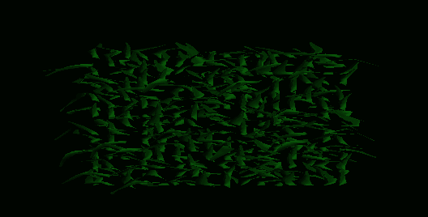

This is an attempt to take the sort of fur effect one might see [in 3D](https://hhoppe.com/fur.pdf) and capture some of that
information in a data texture. The preliminary steps are the same, but then the waviness of the fur is compressed into the
texels: one layer per component (RGB), along with opaque and fixed parts (alpha). In particular, the layers capture several
moments of time in individual bits, indicating whether any fur was visible then at that texel; whereas a tint is recorded
in the alpha according to any hairs always being there, along with any "skin".

Needless to say this is rather lossy, but with suitable constraints on the hairs it actually yields passable results.

A description of the current state (and a brief video) may be found [here](https://forums.solar2d.com/t/fur-take-two/354724)
and a previous effort is [here](https://forums.solar2d.com/t/fur-foliage-wip/343798).

---

The "separated" module was an experiment but so far looks to be a dud.

---

These images are based on [this (also somewhat old) paper](https://www.cs.otago.ac.nz/staffpriv/mccane/publications/fur_simulation.pdf).

The first one basically follows the approach in the paper (with some guesswork, probably wrong). It uses a simplex noise-based wind to generate the four corner springs, then interpolate the parameters in the vertex kernel. It's a single draw call: one static mesh.

The second one takes a different approach, and instead updates some parameters used to look into simplex noise on the shader side, to see how more or less independent blades would look. Once again, it's a single mesh.

These are found in the "spring_continuum" files.
